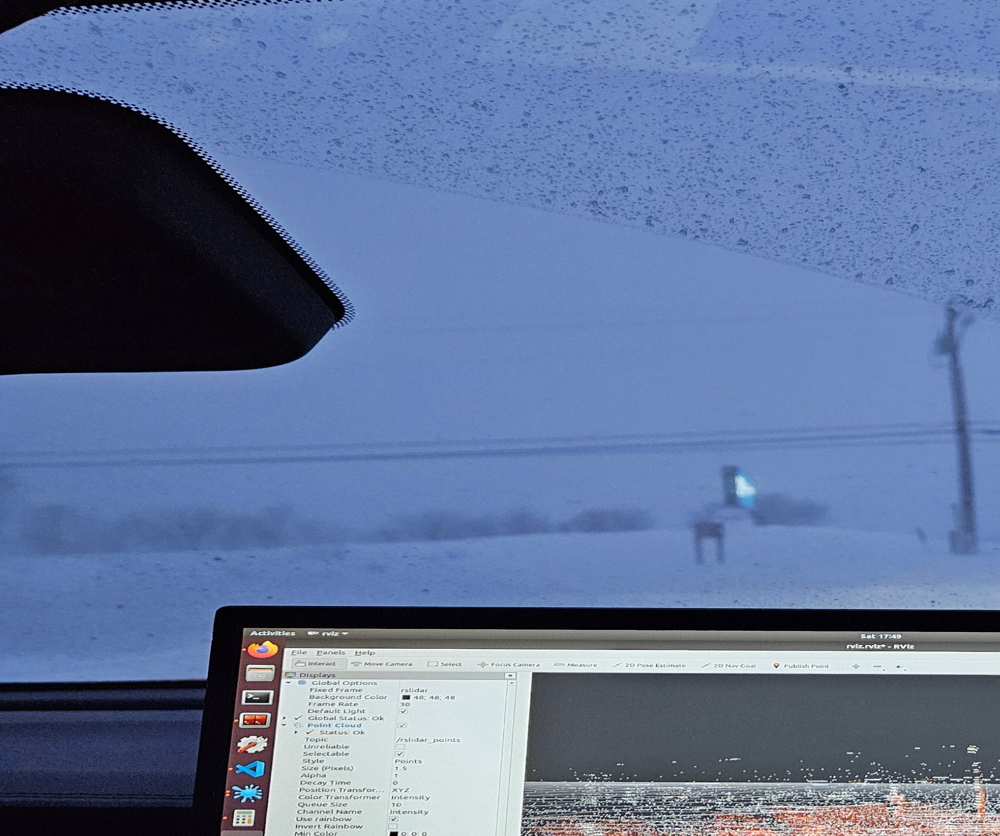

Hello all, I'm Ryan Verbrugge and I'm a fourth year Robotics major at Michigan Tech where I focus on perception and mapping systems for autonomous vehicles. I'm currently finishing my final semester here for my bachelor's and starting into my masters at Tech in Electrical and Computer Engineering this upcoming Fall (2025). For more information on my background you can check out my [CV](https://rcverbru.github.io/cv/) or [Background](https://rcverbru.github.io/background/) pages.

Most of my work has been on GM and SAE's AutoDrive Challenge II but have done work within the research space on similar projects. Below are some images from each of my projects each of which link to their accompanying pages with more description of my owm work accomplishments and contributions.

## Research Interests

* Perception Systems for Autonomous Vehicles
* Mapping and Planning Systems for Autonomous Vehicles
* Wildlife Conservation using Automotive Grade Sensors
* LiDAR Object Detection in Adverse Weather Conditions
* Autonomous Vehicle Simulation

## Projects and Research

| AutoDrive Challenge II | DNR Bat Counting | LiDAR Winter Adverse DataSet |
| -- | -- | -- |
|  |  |  |

| TBD | TBD | TBD |
| -- | -- | -- |
| TBD | TBD | TBD |

## Research Group - Robust Autonomous Systems Lab (RASL)

<table>
  <tbody>
    <tr>
      <td align="center"></img></td>
      <td>
        <li><a href="https://bitbucket.org/autonomymtu/workspace/repositories/">MTU Autonomy Bitbucket</a></li>
        <li><a href="https://www.researchgate.net/lab/Robust-Autonomous-Systems-Lab-Jeremy-Patrick-Bos">Lab Research Gate</a></li>
      </td>
    </tr>
    <tr>
      <td>
        <b>Advisor: </b>
        Dr. Jeremy Bos
        <ul>
          <li><a href="https://pages.mtu.edu/~jpbos/Jeremys_Homepage/Home.html">Personal Website</a></li>
          <li><a href="https://pages.mtu.edu/~jpbos/Jeremys_Homepage/Home.html">MTU Faculty Webpage</a></li>
        </ul>
      </td>
      <td>
        <b>Current Graduate Research Students:</b>
        <ul>
          <li>Chaz Cornwall</li>
          <li>Carl Greene</li>
          <li>Ian Mattson</li>
          <li><a href="https://lpschexn.github.io/">Logan Schexnaydre</a></li>
          <li>Ian Mattson</li>
        </ul>
      </td>
    </tr>
  </tbody>
</table>
