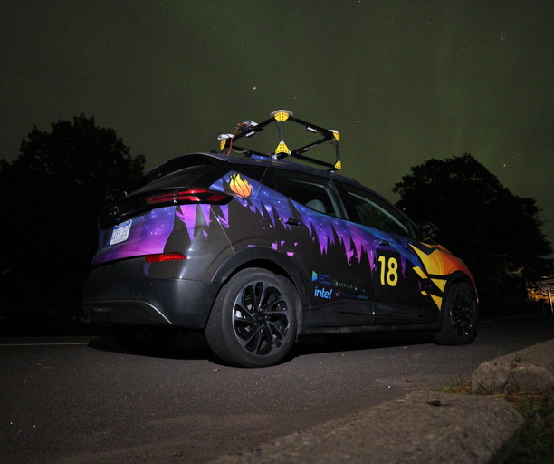
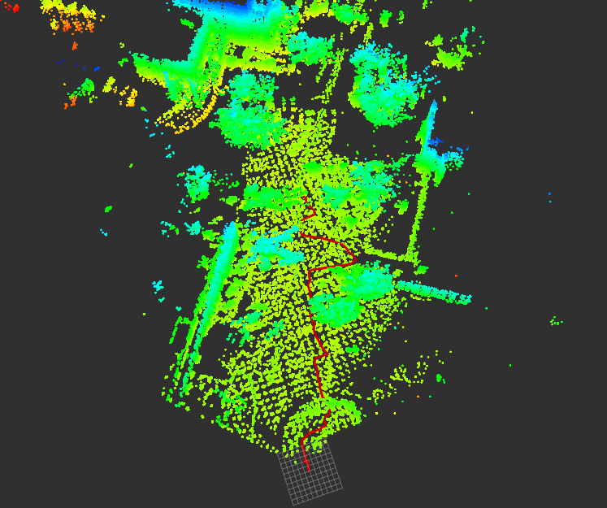

# Current Projects

I don't currently have anything major that I'm working on beyond this site itself. If you want more interesting things that I've been working on head over the my research page. I'm still working with Carl Greene on the [DNR Bat Population tracking project](https://rcverbru.github.io/research/bats/).

# Previous Projects

<body>
    <h1 id="projects-and-research">Projects and Research</h1>
    <table>
        <thead>
            <tr>
                <th>AutoDrive Challenge II</th>
                <th>The Divining Rod</th>
                <th>TBD</th>
            </tr>
        </thead>
        <tbody>
            <tr>
                <td></td>
                <td></td>
            </tr>
        </tbody>
    </table>
</body>

- [AutoDrive](https://rcverbru.github.io/projects/autodrive)
- [The Diviner](https://rcverbru.github.io/projects/diviner)
